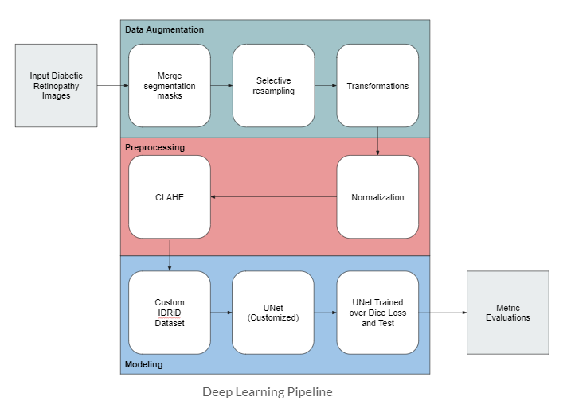
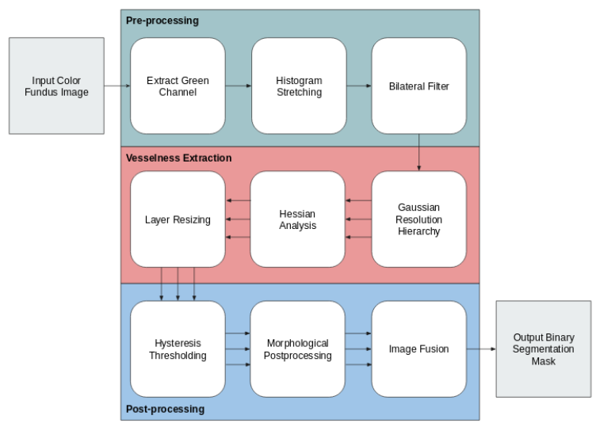

# IDRiD
Repository consisting of computer vision and machine learning techniques on INRiD dataset

### Setup of the project 

Import the IDRiD dataset in the resources tab of the repository.

        -> resources 
              -> Task1
                   -> Test
                   -> Train
              -> Task2
                   -> Test
                   -> Training

      
## Abstract

### Task 1
 Diabetic retinopathy, known as diabetic eye disease, is a medical condition which damages the retina due to diabetes mellitus. This report is an attempt to solve the problem where we use Deep Learning to segment the four categories of lesions in a retinal image. We present a network and training strategy that relies on the strong use of data augmentation to use the available annotated samples efficiently. The architecture consists of a contracting path to capture context and a symmetric expanding path that enables precise localization. The model used is a fine tuned U-Net which is an enhanced encoder-decoder CNN model and we attained Jaccard Similarity of 0.3093 and a Dice Similarity of 0.3838 respectively.

### Task 2
 The segmentation of blood vessels can be used for various retinal imaging. We present a report of our study of a Resolution Hierarchy based method. The method reduces computational needs and could detect vessel of different thickness by using a Gaussian resolution hierarchy. The algorithm reported an accuracy of 87.5% while taking less time to run.

 The tasks done as part of this repository is available at `report/paper.pdf`

## Process flow

### Task 1

### Task 2

      
      
## Dataset

The original dataset given is of the shape (54, 2, 2848, 4288, 3)

	The positions for the shape is (I, S, H, W, C)
	    
	    
	where 
	          
	I is the Input size of the dataset
	S is the number of datasplits and in our case it is the train and test data
	H is the Height of an image
	W is the Width of an image
	C is the number of channels
     		
     
The datasets can be obtained from the IDRiD website which is licensed under a Creative Commons Attribution 4.0 International License. 
      
## Commands

To run the project program, type the following command:

`python main.py -m Train -dir original_retinal_images -imf jpg`